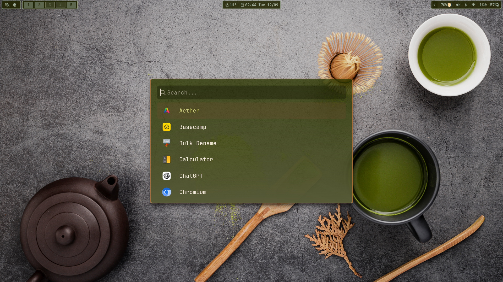
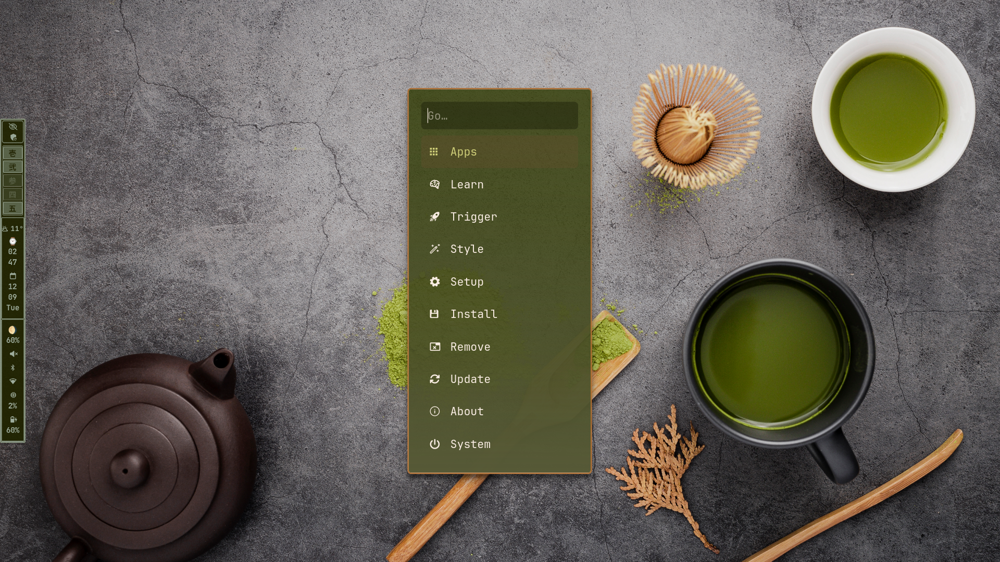

# matcha - omarchy theme & dotfiles

This repository contains personal desktop environment settings for Omarchy (Arch Linux & Hyprland).
<details>
<summary>日本語</summary>
このリポジトリには、Omarchy (Arch Linux & Hyprland) のための個人的なデスクトップ環境設定が含まれています。
</details>

## Screenshots




## Installation
1.  **Clone the repository:**
    
    ```bash
    git clone https://github.com/kei001nao/Omarchy-Dotfiles-And-Settings.git ~/.dotfiles
    ```

2.  **Run the installer:**
    The installer will install packages, copy configuration files.
    
    ```bash
    cd ~/.dotfiles/install
    chmod +x *.sh
    ./install.sh
    ```
    *Note: Review the package lists (`pkglist.txt`, `aur_pkglist.txt`) in the `install` directory before running the script if you wish to customize the installed applications.*

<details>
<summary>日本語</summary>

1.  **リポジトリをクローンする:**
    
    ```bash
    git clone https://github.com/kei001nao/Omarchy-Dotfiles-And-Settings.git ~/.dotfiles
    ```

2.  **インストーラーを実行する:**
    インストーラーはパッケージをインストールし、設定ファイルをコピーします。
    
    ```bash
    cd ~/.dotfiles/install
    chmod +x install.sh
    ./install.sh
    ```
    *注意: インストールされるアプリケーションをカスタマイズしたい場合は、スクリプトを実行する前に `install` ディレクトリ内のパッケージリスト (`pkglist.txt`, `aur_pkglist.txt`) を確認してください。*
    </details>

## Key Components

This setup utilizes the following key components and configurations:

* **Base Theme & Waybar:** [omarchy-oxford-theme](https://github.com/HANCORE-linux/omarchy-oxford-theme)
* **Ghostty Shader:** [Cursor shaders for ghostty](https://github.com/sahaj-b/ghostty-cursor-shaders)
* **File Managers:** Thunar, Yazi
* **Editors:** Kate, nano, VSCode
* **Hyprland Plugins:** Hyprscrolling, Hyprexpo
* **Hyprland Extensions:** Pyprland
* **Blue Light Filter:** sunsetr
* **Input Method:** fcitx5, mozc
* **AI**: Gemini-CLI
* **Other**: [omarchy-theme-hook](https://github.com/imbypass/omarchy-theme-hook/tree/main), [tema](https://github.com/bjarneo/tema)


<details>
<summary>日本語</summary>

## 主要なコンポーネント

このセットアップは、以下の主要なコンポーネントと設定を利用しています。

*   **ベーステーマ & Waybar:** [omarchy-oxford-theme](https://github.com/HANCORE-linux/omarchy-oxford-theme)
*   **Ghostty シェーダー:** [Cursor shaders for ghostty](https://github.com/sahaj-b/ghostty-cursor-shaders)
*   **ファイルマネージャー:** Thunar, Yazi
*   **エディタ:** Kate, nano, VSCode
*   **Hyprland プラグイン:** Hyprscrolling, Hyprexpo
*   **Hyprland 拡張機能:** Pyprland
*   **ブルーライトフィルター:** sunsetr
*   **入力メソッド:** fcitx5, mozc
*   **AI**: Gemini-CLI
*   **その他**: [omarchy-theme-hook](https://github.com/imbypass/omarchy-theme-hook/tree/main), [tema](https://github.com/bjarneo/tema)

</details>

## What the Installer Does

The `install.sh` script automates the following tasks:

-   **Installs Packages:** Installs all packages listed in `pkglist.txt` (from official repositories) and `aur_pkglist.txt` (from the AUR).
-   **Copies Configuration:** All configuration files and directories are copied to your home directory (`~/`).
-   **Backs Up Existing Files:** Any existing files that would be overwritten are backed up to `~/setup_backup_YYYY-MM-DD`.


<details>
<summary>日本語</summary>

## インストーラーの動作

`install.sh` スクリプトは、以下のタスクを自動化します。

-   **パッケージのインストール:** `pkglist.txt`（公式リポジトリから）と `aur_pkglist.txt`（AURから）に記載されているすべてのパッケージをインストールします。
-   **設定のコピー:** すべての設定ファイルとディレクトリをホームディレクトリ（`~/`）にコピーします。
-   **既存ファイルのバックアップ:** 上書きされる既存ファイルは `~/setup_backup_YYYY-MM-DD` にバックアップされます。
</details>

## Manual Configuration

This section describes the manual setup required after running the installer.

### Firefox Customization

To apply custom styles (`userChrome.css`) to Firefox, you must run a separate script **after** starting Firefox at least once.

1.  **Start Firefox:** Launch Firefox normally to create a user profile.
2.  **Run the Firefox setup script:**
    
    ```bash
    cd ~/.dotfiles/install
    chmod +x setup-firefox.sh
    ./setup-firefox.sh
    ```

### Hyprland Plugins Installation
Install and enable official plugins `hyprexpo` and `hyprscrolling`.

1.  **Update `hyprpm`:**
    
    ```bash
    hyprpm update
    ```
    
2.  **Install & Enable Plugins:**
    
    ```bash
    hyprpm add https://github.com/hyprwm/hyprland-plugins
    hyprpm enable hyprexpo
    hyprpm enable hyprscrolling
    ```

*Note: Don't forget to add the following line to your `hyprland.conf` or similar configuration file:*

```
exec-once = hyprpm reload -n
```
*For more details on plugins, refer to the official plugin website.*


<details>
<summary>日本語</summary>

## 手動設定

このセクションでは、インストーラー実行後に必要な手動設定について説明します。

### Firefoxのカスタマイズ

カスタムスタイル（`userChrome.css`）をFirefoxに適用するには、**Firefoxを最低一度は起動した後で**、別のスクリプトを実行する必要があります。

1.  **Firefoxを起動:** 通常通りFirefoxを起動し、ユーザープロファイルを作成します。
2.  **Firefoxセットアップスクリプトを実行:**
    
    ```bash
    cd ~/.dotfiles/install
    chmod +x setup-firefox.sh
    ./setup-firefox.sh
    ```

### Hyprland plugin インストール
公式プラグイン `hyprexpo` と `hyprscrolling` をインストールして有効化します。

1.  **`hyprpm`をアップデート:**
    
    ```bash
    hyprpm update
    ```
    
2.  **プラグインのインストールと有効化:**
    
    ```bash
    hyprpm add https://github.com/hyprwm/hyprland-plugins
    hyprpm enable hyprexpo
    hyprpm enable hyprscrolling
    ```

*注意: `hyprland.conf` などの設定ファイルに以下の行を追加するのを忘れないでください:*

```
exec-once = hyprpm reload -n
```
*プラグインの詳細は、公式のプラグインウェブサイトを参照してください。*
</details>

### Thunar Google Drive Integration

To display Google Drive in Thunar:

1.  **Launch Gnome Control Center:**
    
    ```bash
    env XDG_CURRENT_DESKTOP=GNOME gnome-control-center --verbose
    ```

2.  **Add Google Account:** In Gnome Control Center, go to "Online Accounts", select "Google", and sign in.

3.  **Verify:** After granting access, confirm that a tree with your Google account name has been added under "Devices" in Thunar.

<details>
<summary>日本語</summary>

### ThunarのGoogle Drive連携

ThunarにGoogle Driveを表示させるには:

1.  **Gnome Control Centerを起動:**
    
    ```bash
    env XDG_CURRENT_DESKTOP=GNOME gnome-control-center --verbose
    ```
    
2.  **Googleアカウントを追加:** Gnome Control Centerで「オンラインアカウント」に進み、「Google」を選択してサインインします。

3.  **確認:** アクセスを許可した後、Thunarの「デバイス」欄にあなたのGoogleアカウント名のツリーが追加されていることを確認します。
</details>

### KVM/QEMU (virt-manager) Setup
This is a guide to setting up KVM/QEMU with `virt-manager`.

1.  **Installation**

    Install the necessary packages:
    ```bash
    sudo pacman -S qemu-full qemu-img libvirt virt-install virt-manager virt-viewer edk2-ovmf dnsmasq swtpm tuned ntfs-3g nftables bridge-utils openbsd-netcat libguestfs
    ```
    *Note: `libosinfo` and `iptables` are often pre-installed. They are omitted here to avoid potential conflicts with `ebtables`.*

    Add your user to the `libvirt` and `kvm` groups:
    ```bash
    sudo usermod -aG libvirt,kvm $(whoami)
    ```
    *Note: If the `libvirt` group does not exist, you may need to re-login for the group changes to apply. You can verify groups with `cat /etc/group | cut -d: -f 1` and apply group changes to your current session with `newgrp libvirt`.*

    **Reboot** after completing this step.

2.  **Start the Service**

    Enable and start the `libvirtd` service:
    ```bash
    sudo systemctl enable --now libvirtd.service
    ```

3.  **Network Configuration (NAT)**

    Especially for Wi-Fi connections, ensure the default network is active.

    Check network status:
    ```bash
    sudo virsh net-list --all
    ```

    Start the default network and set it to autostart:
    ```bash
    sudo virsh net-start default
    sudo virsh net-autostart default
    ```
    
    Verify that the `default` network is `active` and `autostart` is `yes`:
    ```
    $ sudo virsh net-list --all
     Name      State    Autostart   Persistent
    --------------------------------------------
     default   active   yes         yes
    ```

4.  **Firewall Backend Configuration**

    Edit `/etc/libvirt/network.conf` to use the `iptables` backend.
    ```bash
    sudo nano /etc/libvirt/network.conf
    ```
    Find and modify the following line (uncomment if necessary):
    ```
    firewall_backend = "iptables"
    ```

5.  **Final Validation**

    Run the host validation tool:
    ```bash
    sudo virt-host-validate qemu
    ```
    **Reboot** your system again.

6.  **Launch Virtual Machine Manager**

    You can now start `virt-manager`.

7.  **Guest OS Installation**

    Proceed with installing your guest OS in `virt-manager`.

8.  **Guest OS Setup (Arch-based)**

    Inside the Arch-based guest, install the SPICE agent for better integration:
    ```bash
    sudo pacman -S spice-vdagent
    sudo systemctl enable --now spice-vdagentd.service
    ```

9.  **Host `virt-manager` Settings (for Guest)**

    For optimal performance, configure the guest's hardware in `virt-manager`:
    -   **Display Spice** -> Type: `Spice server`, Listen Type: `None`
    -   **Video** -> Model: `Virtio`

10. **Guest OS Hyprland Configuration**

    Inside the guest, adjust your Hyprland configuration for the virtual monitor.

    Check the monitor specifications:
    ```bash
    hyprctl monitors
    ```

    Edit your monitor configuration file accordingly (e.g., `~/.config/hypr/monitors.conf`):
    ```bash
    nvim ~/.config/hypr/monitors.conf
    ```

<details>
<summary>日本語</summary>

### KVM/QEMU (virt-manager) セットアップ

これは `virt-manager` を使ってKVM/QEMUをセットアップするためのガイドです。

1.  **インストール**

    必要なパッケージをインストールします:
    ```bash
    sudo pacman -S qemu-full qemu-img libvirt virt-install virt-manager virt-viewer edk2-ovmf dnsmasq swtpm tuned ntfs-3g nftables bridge-utils openbsd-netcat libguestfs
    ```
    *注意: `libosinfo` と `iptables` は既にインストールされていることが多いため、`ebtables`との潜在的な競合を避けるためにここでは省略しています。*

    ユーザーを `libvirt` と `kvm` グループに追加します:
    ```bash
    sudo usermod -aG libvirt,kvm $(whoami)
    ```
    *注意: `libvirt` グループが存在しない場合、グループの変更を適用するために再ログインが必要になることがあります。`cat /etc/group | cut -d: -f 1` でグループを確認し、`newgrp libvirt` で現在のセッションにグループの変更を適用できます。*

    このステップが完了したら **再起動** してください。

2.  **サービスの開始**

    `libvirtd` サービスを有効化して起動します:
    ```bash
    sudo systemctl enable --now libvirtd.service
    ```

3.  **ネットワーク設定 (NAT)**

    特にWi-Fi接続の場合、デフォルトネットワークがアクティブであることを確認してください。

    ネットワークの状態を確認します:
    ```bash
    sudo virsh net-list --all
    ```

    デフォルトネットワークを起動し、自動起動を設定します:
    ```bash
    sudo virsh net-start default
    sudo virsh net-autostart default
    ```
    
    `default` ネットワークが `active` で、`autostart` が `yes` になっていることを確認します:
    ```
    $ sudo virsh net-list --all
     Name      State    Autostart   Persistent
    --------------------------------------------
     default   active   yes         yes
    ```

4.  **ファイアウォールバックエンドの設定**

    `/etc/libvirt/network.conf` を編集して `iptables` バックエンドを使用するようにします。
    ```bash
    sudo nano /etc/libvirt/network.conf
    ```
    以下の行を見つけて修正します（必要であればコメントを解除）:
    ```
    firewall_backend = "iptables"
    ```

5.  **最終確認**

    ホストの検証ツールを実行します:
    ```bash
    sudo virt-host-validate qemu
    ```
    再度システムを **再起動** してください。

6.  **Virtual Machine Managerの起動**

    これで `virt-manager` を起動できます。

7.  **ゲストOSのインストール**

    `virt-manager` でゲストOSのインストールを進めてください。

8.  **ゲストOSのセットアップ (Archベース)**

    Archベースのゲスト内で、より良い統合のためにSPICEエージェントをインストールします:
    ```bash
    sudo pacman -S spice-vdagent
    sudo systemctl enable --now spice-vdagentd.service
    ```

9.  **ホスト `virt-manager` の設定 (ゲスト用)**

    最適なパフォーマンスを得るために、`virt-manager` でゲストのハードウェアを設定します:
    -   **Display Spice** -> Type: `Spice server`, Listen Type: `None`
    -   **Video** -> Model: `Virtio`

10. **ゲストOSのHyprland設定**

    ゲスト内で、仮想モニターに合わせてHyprlandの設定を調整します。

    モニタースペックを確認します:
    ```bash
    hyprctl monitors
    ```

    モニター設定ファイルを適宜編集します (例: `~/.config/hypr/monitors.conf`):
    ```bash
    nvim ~/.config/hypr/monitors.conf
    ```
</details>
